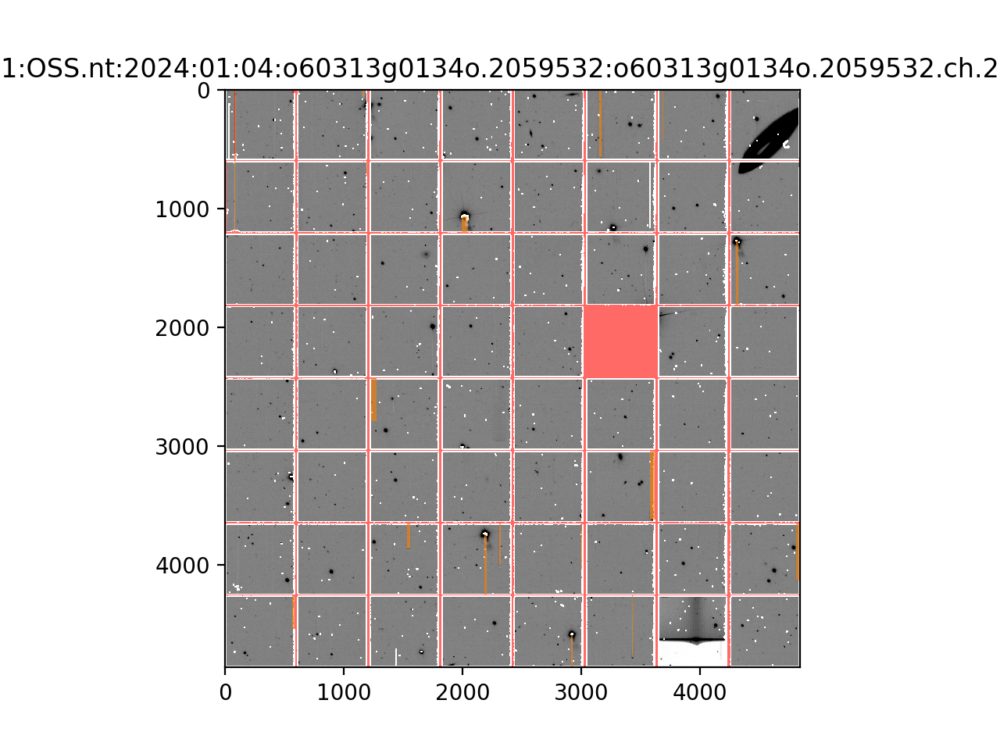

[](https://github.com/psf/black)

## `ippy`

`ippy` is a Python package for interaction with Pan-STARRS Image Processing Pipeline (IPP) data products and databases and for helping perform operational tasks. It provides various functionalities to facilitate IPP-specific FITS IO and masks manipulation, and Nebulous tools to augment the existing `neb-*` command line tools of IPP. It was developed for internal use of the IPP development and operation team.

## Installation

Simple clone the repository and start using it:

```
git clone https://github.com/hgao-astro/ippy.git
cd ippy
pip install .
# or install a development copy
pip install -e .
```
Note that `ippy` is only tested with Python 3.6 and above.


## Usage

### FITS IO

IPP FITS images come in two formats: single chip image formed by 64 cells stitched together `XYxx.ch.[mk.]fits` and individual cell images in one multi-extension FITS file `XYxx.[mk.]fits`. `ippy.io` provides `ChipHDUList` and `CellHDUList` classes to facilitate the IO of the above two, respectively. Both are subclasses of `astropy.io.fits.HDUList` and are exposed through functions `read_chip` and `read_cell` as follows:

```python
>>> from ippy.io import read_chip, read_cell
>>> chip_hdul = read_chip("gpc1/OSS.nt/2024/01/04/o60313g0134o.2059532/o60313g0134o.2059532.ch.2704906.XY25.ch.fits", mask="gpc1/OSS.nt/2024/01/04/o60313g0134o.2059532/o60313g0134o.2059532.ch.2704906.XY25.ch.mk.fits")
>>> chip_hdul.info()
Filename: /data/ipp148.1/nebulous/d8/8f/17492822457.gpc1:OSS.nt:2024:01:04:o60313g0134o.2059532:o60313g0134o.2059532.ch.2704906.XY25.ch.fits
No.    Name      Ver    Type      Cards   Dimensions   Format
  0  PRIMARY       1 PrimaryHDU       6   ()
  1  data          1 CompImageHDU    427   (4846, 4868)   float32
  2  mask          1 CompImageHDU    464   (4846, 4868)   float32
>>> chip_img = chip_hdul.get_data(masked=True)
>>> cell_img = chip_hdul.slice_cell_from_chip("xy12", masked=True)
>>> chip_img.shape, cell_img.shape
((4868, 4846), (598, 590))
>>> chip_hdul.display(show_mask=True, dpi=200)
>>> plt.show()
```



```python
>>> cell_hdul = read_cell("gpc1/20240104/o60313g0133o/o60313g0133o.ota23.fits")
>>> cell_hdul.info()
Filename: /data/ipp152.1/nebulous/1d/f4/17492785753.gpc1:20240104:o60313g0133o:o60313g0133o.ota23.fits
No.    Name      Ver    Type      Cards   Dimensions   Format
  0  PRIMARY       1 PrimaryHDU     397   ()
  1  xy00          1 CompImageHDU    142   (590, 598)   float32
  2  xy10          1 CompImageHDU    142   (590, 598)   float32
...  
 62  xy57          1 CompImageHDU    142   (590, 598)   float32
 63  xy67          1 CompImageHDU    142   (590, 598)   float32
 64  xy77          1 CompImageHDU    142   (590, 598)   float32
>>> cell_img = cell_hdul.get_data("xy24")
>>> chip_img = cell_hdul.assemble_chip()
>>> cell_img.shape, chip_img.shape
((598, 590), (4784, 4720))
```
Both subclasses supports IO with physical and Nebulous paths. Both enable easy bundling of data image(s) and mask image(s) and applying masks by setting pixels to `NaN`. `ChipHDUList.display` displays the chip image in a linear and zscaled grey-scale figure, optionally with a mask overlaid. `ChipHDUList.slice_cell_from_chip` slices out individual cells or a set of spatially continuous cells from the chip image. `CellHDUList.assemble_chip` assembles the cell images into a chip image (without gaps between the cells at the moment).

### Nightly Processing

`ippy.processing.nightly_obs` contains classes (`Visit`, `WWDiff`, `Quad`, `Chunk`, and `Night`) that represents nightly observation concepts and methods for queuing diff processing. For most of time, you will only need `Night` and `Chunk`. The lower level classes are used by these two, in a way that a `Night` contains a list of `Chunk` that consist of `Quad` of `Visit` (single exposure) and pairs of `Visit` form `WWDiff` (warp warp difference image). They provide the basis for `check_chunk_progress.py` and `queue_wwdiffs.py`, which are used to monitor the progress of nightly processing and to queue warp$-$warp diff processing, respectively. Below are some examples checking processing of a night and certain chunks.

```python
>>> from ippy.processing import Night, Chunk
# 2024-01-05 UTC night of GPC2 observations
>>> night = Night(dateobs="2024-01-05", dbname="gpc2")
>>> night
<Night 2024-01-05 in gpc2: 9 chunks>
>>> night.chunks
[<Chunk OSSR.R04N3.8.Q.w complete: 20/20 quads completed, 20/0/0 fully/over/partially processed, gpc2 on 2024-01-05>, <Chunk OSSR.R04N1.8.Q.w truncated: 0/6 quads completed, 6/0/0 fully/over/partially processed, gpc2 on 2024-01-05>, <Chunk XSS.20240105.A.P.w truncated: 0/1 quads completed, 0/0/1 fully/over/partially processed, gpc2 on 2024-01-05>, <Chunk OSSR.R07N3.8.Q.w complete: 20/20 quads completed, 20/0/0 fully/over/partially processed, gpc2 on 2024-01-05>, <Chunk XSS.20240105.B.P.w truncated: 0/1 quads completed, 0/0/1 fully/over/partially processed, gpc2 on 2024-01-05>, <Chunk OSSR.R06N6.8.Q.w truncated: 0/19 quads completed, 19/0/0 fully/over/partially processed, gpc2 on 2024-01-05>, <Chunk OSSR.R09S1.8.Q.w complete: 18/18 quads completed, 18/0/0 fully/over/partially processed, gpc2 on 2024-01-05>, <Chunk OSSR.R11N5.8.Q.w complete: 18/18 quads completed, 18/0/0 fully/over/partially processed, gpc2 on 2024-01-05>, <Chunk OSSR.R09N2.8.Q.w complete: 14/14 quads completed, 14/0/0 fully/over/partially processed, gpc2 on 2024-01-05>]
# a truncated chunk: GPC1 OSSR.R03N6.11.Q.w on 2024-01-08
>>> chunk = Chunk("OSSR.R03N6.11.Q.w", "gpc1", dateobs="2024-01-08")
>>> chunk
<Chunk OSSR.R03N6.11.Q.w truncated: 0/10 quads completed, 10/0/0 fully/over/partially processed, gpc1 on 2024-01-08>
>>> chunk.quads
[<Quad ps1_27_2736 incomplete and processed: 1 visits, 0 WWdiffs>, <Quad ps1_27_1363 incomplete and processed: 2 visits, 1 WWdiffs>, <Quad ps1_27_2710 incomplete and processed: 1 visits, 0 WWdiffs>, <Quad ps1_27_1184 incomplete and processed: 2 visits, 1 WWdiffs>, <Quad ps1_27_1380 incomplete and processed: 1 visits, 0 WWdiffs>, <Quad ps1_27_1365 incomplete and processed: 1 visits, 0 WWdiffs>, <Quad ps1_27_2737 incomplete and processed: 1 visits, 0 WWdiffs>, <Quad ps1_27_5620 incomplete and processed: 1 visits, 0 WWdiffs>, <Quad ps1_27_5619 incomplete and processed: 2 visits, 1 WWdiffs>, <Quad ps1_27_1379 incomplete and processed: 2 visits, 0 WWdiffs>]
>>> chunk.quads[-1].visits
[<Visit 1: raw=o60317g0011o 2061631 on 06:03, chip=2706816 cleaned, cam=2664828 full, warp=2628910 full>, <Visit 2: raw=o60317g0021o 2061641 on 06:13, chip=2706826 cleaned, cam=2664838 full quality 4007, warp=None None>]
>>> chunk.quads[1].visits
[<Visit 1: raw=o60317g0009o 2061629 on 06:01, chip=2706814 cleaned, cam=2664826 full, warp=2628906 full>, <Visit 2: raw=o60317g0019o 2061639 on 06:11, chip=2706824 cleaned, cam=2664836 full, warp=2628916 full>]
>>> chunk.quads[1].wwdiffs
[<WWDiff 2464025 cleaned registered on 06:32: visit 1 - visit 2, warp1 - warp2 = 2628906 - 2628916, publish=1838968 full>]
# a full chunk: GPC1 OSSR.R01N1.8.Q.w on 2024-01-05
>>> chunk = Chunk("OSSR.R01N1.8.Q.w", "gpc1", dateobs="2024-01-05")
>>> chunk
<Chunk OSSR.R01N1.8.Q.w complete: 20/20 quads completed, 20/0/0 fully/over/partially processed, gpc1 on 2024-01-05>
>>> chunk.quads
[<Quad ps1_24_4872 complete and processed: 4 visits, 2 WWdiffs>, <Quad ps1_24_4876 complete and processed: 4 visits, 2 WWdiffs>, <Quad ps1_24_4734 complete and processed: 4 visits, 2 WWdiffs>, <Quad ps1_24_4713 complete and processed: 4 visits, 2 WWdiffs>, <Quad ps1_24_4853 complete and processed: 4 visits, 2 WWdiffs>, <Quad ps1_24_4723 complete and processed: 4 visits, 2 WWdiffs>, <Quad ps1_24_4896 complete and processed: 4 visits, 2 WWdiffs>, <Quad ps1_24_4900 complete and processed: 4 visits, 2 WWdiffs>, <Quad ps1_24_4712 complete and processed: 4 visits, 2 WWdiffs>, <Quad ps1_24_4875 complete and processed: 4 visits, 2 WWdiffs>, <Quad ps1_24_4722 complete and processed: 4 visits, 2 WWdiffs>, <Quad ps1_24_4877 complete and processed: 4 visits, 2 WWdiffs>, <Quad ps1_24_4852 complete and processed: 4 visits, 2 WWdiffs>, <Quad ps1_24_4733 complete and processed: 4 visits, 2 WWdiffs>, <Quad ps1_24_4851 complete and processed: 4 visits, 2 WWdiffs>, <Quad ps1_24_4833 complete and processed: 4 visits, 2 WWdiffs>, <Quad ps1_24_4924 complete and processed: 4 visits, 2 WWdiffs>, <Quad ps1_24_4874 complete and processed: 4 visits, 2 WWdiffs>, <Quad ps1_24_4898 complete and processed: 4 visits, 2 WWdiffs>, <Quad ps1_24_4855 complete and processed: 4 visits, 2 WWdiffs>]
>>> chunk.quads[0].visits
[<Visit 1: raw=o60314g0110o 2060051 on 05:37, chip=2705364 cleaned, cam=2663376 full, warp=2627457 full>, <Visit 2: raw=o60314g0130o 2060071 on 05:57, chip=2705384 cleaned, cam=2663396 full, warp=2627480 full>, <Visit 3: raw=o60314g0150o 2060091 on 06:16, chip=2705404 cleaned, cam=2663416 full, warp=2627501 full>, <Visit 4: raw=o60314g0170o 2060111 on 06:35, chip=2705424 cleaned, cam=2663436 full, warp=2627518 full>]
>>> chunk.quads[0].wwdiffs
[<WWDiff 2462072 cleaned registered on 06:33: visit 1 - visit 2, warp1 - warp2 = 2627457 - 2627480, publish=1837236 full>, <WWDiff 2462107 cleaned registered on 06:53: visit 3 - visit 4, warp1 - warp2 = 2627501 - 2627518, publish=1837270 full>]
```


### Nebulous Tools

### Misc.